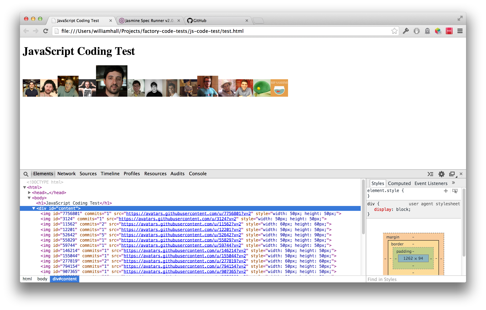

# JavaScript Coding Test

This is a technical test.

The challenge of this test was to make an AJAX request to Github to get the last 20 commits for a certain repository, then add the avatars of the committers to the `#content` div.

The more commits they have made, the bigger the avatar should be. For example:

* 1 commit, 50px x 50px 
* 2 commits, 60px x 60px 
* 3 commits, 70px x 70px 
* ...

Technologies used
----
-Javascript
-jQuery
-Jasmine
-AJAX
-Git
-Github API

How to run it
----
```sh
cd js-code-test
open test.html
```

How to run unit tests
----
```sh
cd js-code-test
open SpecRunner.html
```

Result:

